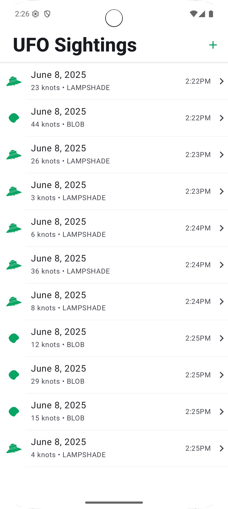
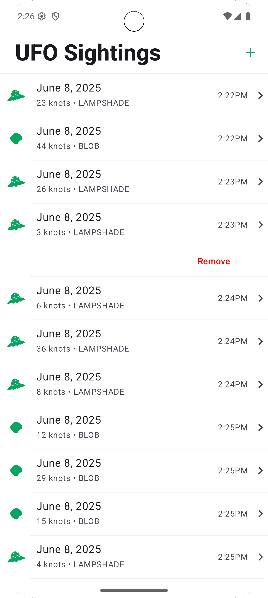
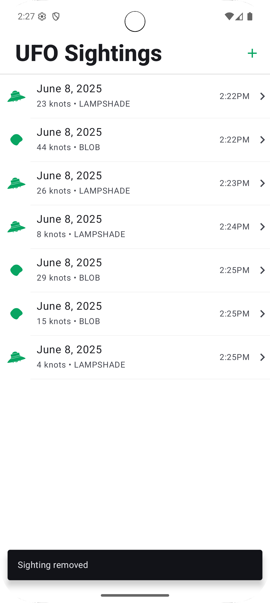

# UFO Sightings App

A basic Android application built with **Jetpack Compose** and **MVVM architecture**. This app displays a list of UFO sightings with functionality to add and remove entries. It's designed to demonstrate clean architecture and UI polish based on a provided Android design spec.

---

## ✨ Features

- 📆 Displays a list of UFO sightings with:
  - Date and time of the sighting
  - Type of UFO (`Blob` or `Lampshade`)
  - Associated icon for each type
  - Speed of the UFO in km/h

- ➕ Add new UFO sightings with random attributes:
  - A "+" button in the top-right corner instantly adds a new entry
  - Each entry is randomly generated (no user input required)
  
- ❌ Remove UFO sightings:
  - **Android**: Tap a list item to show the "Remove" button
  - Entries are removed from the list in-memory and the UI updates accordingly

- 🧠 In-memory data storage:
  - No web services or persistent storage are used
  - All data is volatile and reset on app restart

- 🧱 Clean MVVM architecture for scalability and maintainability
- 🎨 UI closely follows provided android design spec (fonts, padding, icons, colors)

---

## 🖼 Screenshots

| Sightings List View | Remove Sighting | Confirm Remove Sighting |
|-----------|--------------|------------------|
|  |  |  |

---

## 🧰 Tech Stack

- **Kotlin**
- **Jetpack Compose**
- **ViewModel + StateFlow**
- **Material 3 Components**
- **Single-Activity Architecture**
- **In-memory state management**

---

## 🏗️ Project Structure
 ```plaintext
com.ghost.ufosightingsapp/
│
├── data/ model/           # Model classes
├── ui/              # Composables (SightingItem, SightingListScreen)
├── vm/              # ViewModel and state management
├── res/
│   ├── drawable/    # UFO icons for blob and lampshade
└── MainActivity.kt  # App entry point
```

## 🚀 Getting Started

1. Clone the repo:
   ```bash
   git clone https://github.com/Asante-Adarkwa-Usman/UFO_Listing.git


